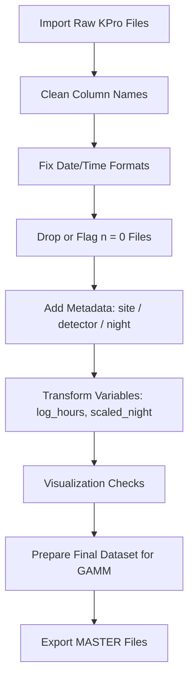

# KPro Masterfile Pipeline

> **⚠️ DEPRECATED QUICKSTART GUIDE**  
> This file contains the original quickstart documentation for version 1.x of the pipeline.  
> **For current documentation, see [README.md](README.md)**

---

**Current Version:** 2.1.0  
**Status:** This legacy README is preserved for historical reference only.

The pipeline has evolved significantly since this documentation was written:
- Now supports 7 distinct workflows (was 2)
- Added comprehensive configuration system (YAML)
- Full Quarto reporting with pre-computed artifacts
- Detector mapping and timezone conversion
- Complete test suite and standards documentation

## Migration Guide

If you're upgrading from version 1.x:

1. Review the new architecture in [README.md](README.md)
2. Check configuration requirements in `inst/config/YAML_PARAMETER_GUIDE.md`
3. Review workflow documentation in `docs/ST_architecture_standards.md`
4. See `docs/QUICKSTART.md` for updated usage instructions (if available)

---

## Original v1.x Documentation (ARCHIVED)

### Basic Usage (v1.x only)

1. Place raw Kaleidoscope Pro outputs (`id.csv`) in `data/raw/`
2. Run: `source("R/01_build_kpro_master.R")`
3. (Optional) Run: `source("R/02_append_previous_masters.R")`
4. Output files saved to `output/` folder

### Dependencies (v1.x)

```r
install.packages(c("tidyverse", "lubridate", "janitor"))
```

**Note:** v2.x has expanded dependencies. See `DESCRIPTION` file for current requirements.

## Workflow Overview

The pipeline follows these high-level steps to process Kaleidoscope Pro outputs and generate a clean MASTER file:

1. **Find all id.csv files recursively** from the raw data directory.  
2. **Read safely**: all columns as character, add a `source` column.  
3. **Canonical column mapping**:
   - Normalize column names (`safe_rename()`)  
   - Merge duplicates into canonical names (`coalesce_variants()`)  
4. **Normalize names & blanks → NA**  
5. **Parse alternates** into `alternate_1`, `alternate_2`, `alternate_3`  
6. **Normalize auto_id** and species recoding  
7. **Remove noise rows** (`n = 0` or `NA`)  
8. **Convert numeric columns safely**  
9. **Date-time parsing**:
   - Parse flexible date & time formats  
   - Create UTC datetime (`Audiomoth_DATETIME_UTC`)  
   - Convert to local CST (`DATETIME_CST`)  
   - Extract date, time, hour (both UTC & CST)  
10. **Optional: Format DATETIME_CST** for Excel  
11. **Safe column removal & cleanup**:
    - Remove unwanted columns  
    - Remove rows where all columns are NA  
12. **Reorder columns** to desired order  
13. **Validation summary**:
    - Print number of rows  
    - Count missing datetime  
    - List unique species  
14. **Export CSVs**:
    - `MASTER_NoNoise_TIMESTAMP.csv`  
    - `MASTER_NoNoise_NoID_TIMESTAMP.csv`  



## Optional: Appending Previous MASTER Files

You can merge previously created MASTER CSV files with the current dataset. This is useful if you have multiple prior MASTER files or want to maintain continuity.

**Steps:**

1. Run the append script:

```r
prev_master_files <- c(file.choose(), file.choose())

for(file in prev_master_files){
  prev <- read_csv(file, col_types = cols(.default = "c")) %>%
    mutate(source = file) %>%
    safe_rename() %>%
    coalesce_variants() %>%
    clean_pipeline_functions()

  kpro <- bind_rows(kpro, prev)
}
```

2. **Notes:**
- You will be prompted to select one or more previous MASTER CSVs.  
- The script cleans and normalizes each file before merging.  
- Rows where all columns are `NA` are removed automatically.  
- The `source` column indicates the original MASTER file for each row.  
- This step is **optional** and can be run multiple times if you have more than one previous MASTER file.

## Output Files

After running the pipeline, the following files are exported to the `output/` folder:

| File | Description |
|------|------------|
| `MASTER_NoNoise_TIMESTAMP.csv` | Cleaned, aggregated MASTER file ready for analysis |
| `MASTER_NoNoise_NoID_TIMESTAMP.csv` | Filtered version with rows missing IDs removed |

**Notes:**

- `TIMESTAMP` is automatically generated based on the date and time of export.  
- Both files are fully cleaned and normalized, consistent with the current pipeline workflow.  
- You can use these files directly for analysis or manual vetting.

## Validation & Checks

Before using the MASTER file for analysis, it’s important to verify the dataset.

**Validation steps:**

1. **Check total rows:**

```r
cat("Total rows:", nrow(kpro), "\n")
```

2. **Check for missing DATETIME_CST values:**

```r
cat("Missing DATETIME_CST:", sum(is.na(kpro$DATETIME_CST)), "\n")
```

3. **List unique species in the dataset:**

```r
cat("Unique species:", paste(unique(kpro$species), collapse = ", "), "\n")
```

**Notes:**

- These checks help ensure that all files were read correctly and merged consistently.  
- You can add additional checks or visual summaries as needed.  
- Any missing or unexpected values should be reviewed before further analysis.

## License

This project is licensed under the MIT License.  

You are free to:

- Use, copy, and modify the code for personal or academic projects  
- Share the code with attribution  

**Note:** This license does **not** provide any warranty. Use the code at your own risk.